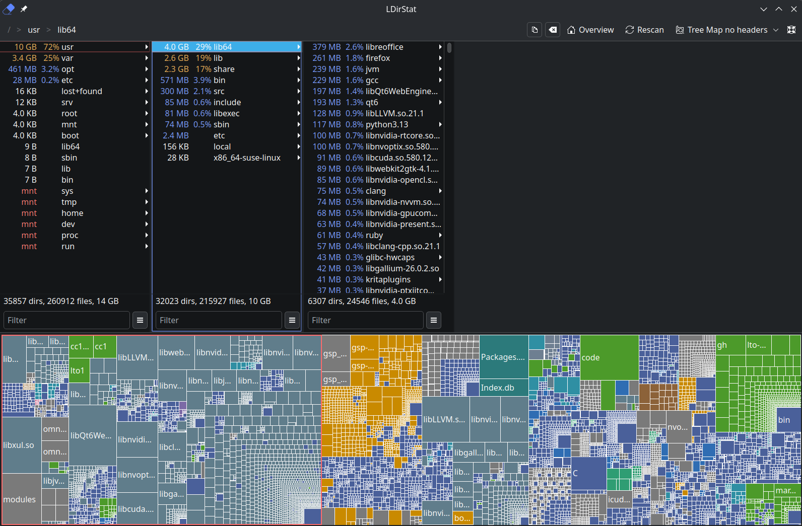
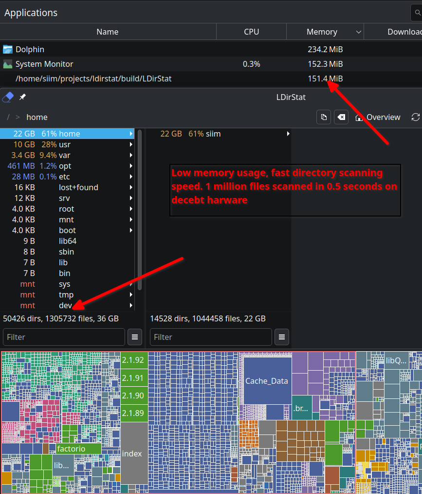

# LDirStat

LDirStat helps you see what is taking up space on your disk.



[App Help](docs/HELP.md)  

[Download](https://github.com/siim-eng/ldirstat/releases)

## Performance

- LDirStat is built to be fast, low-latency analysis with low memory usage for exploring large directory trees.



## Repository Layout

- `src/` application code
- `src/app/` GUI application entry point
- `src/core/` non-Qt core logic for scanning, data structures, and layout calculations
- `src/ui/` Qt widgets, dialogs, and main window code
- `bench/` small benchmark and helper executables
- `docs/` user-facing documentation and screenshots
- `scripts/` build, formatting, linting, and analysis helpers
- `packaging/` AppImage packaging support
- `.github/` CI and release workflows

## Build

```bash
cmake -B build -G Ninja -DCMAKE_BUILD_TYPE=Release
cmake --build build --target LDirStat
```

## AppImage

Build an AppImage for the GUI application only:

```bash
./packaging/build-appimage.sh
```

The script stages an AppDir via `cmake --install --component App`, bundles Qt
with `linuxdeploy`, and writes the result to `dist/LDirStat-<version>-x86_64.AppImage`.

## Releasing

1. Update the version in `CMakeLists.txt`:
   ```
   project(ldirstat VERSION 0.3.0 LANGUAGES CXX)
   ```
2. Commit, tag, and push:
   ```bash
   git add CMakeLists.txt
   git commit -m "v0.3.0"
   git tag v0.3.0
   git push origin main v0.3.0
   ```

The tag must match the project version (`v<VERSION>`). Pushing a `v*` tag
triggers the [Release AppImage](.github/workflows/release-appimage.yml)
workflow, which builds an AppImage and publishes a GitHub release.

### Distribution Notes

- The AppImage bundles the Qt runtime for `LDirStat` only. Benchmark tools are not included.
- Mounting removable devices still depends on the host providing `udisksctl` from `udisks2`.
- Opening a terminal still depends on a host terminal emulator such as `konsole`,
  `gnome-terminal`, `xfce4-terminal`, or `xterm`.
