# LDirStat Help

LDirStat analyzes disk usage so you can see what is taking up space on your drives.

## Welcome Screen

When you open LDirStat, the welcome screen gives you a few quick ways to begin:

- **Open Home** scans your home folder
- **Open Root** scans the main filesystem starting at `/`
- **Open Other Directory...** lets you choose any folder

Below that is a list of available filesystems and devices.

- Click a mounted filesystem to scan it
- Click an unmounted device to mount it and then start scanning
- Mounted entries show the device path, mount point, and free space

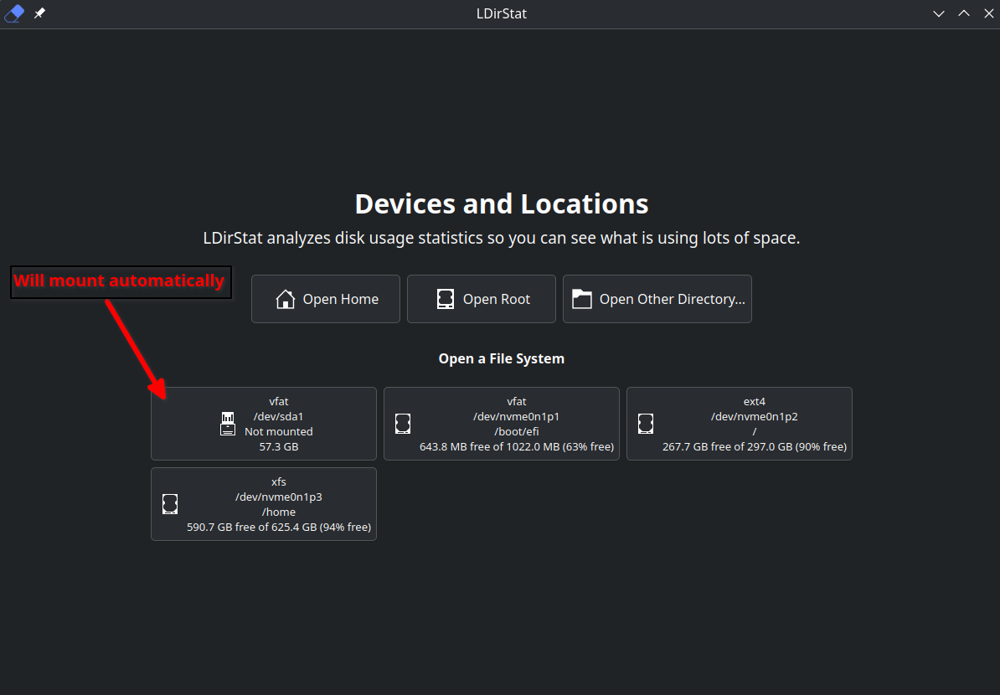

## Scanning

After you choose a location, LDirStat switches to a scan progress view.

- The progress bar shows that a scan is in progress (for EXT4 it shows actual prograss, btrfs shows infinite progressbar)
- Live counters show how many files and directories have been found so far 
- Click **Stop** to cancel the scan

The same progress view is also used when you continue scanning into a mount point later.

If you stop a mount-point continuation, that mount point stays unscanned.

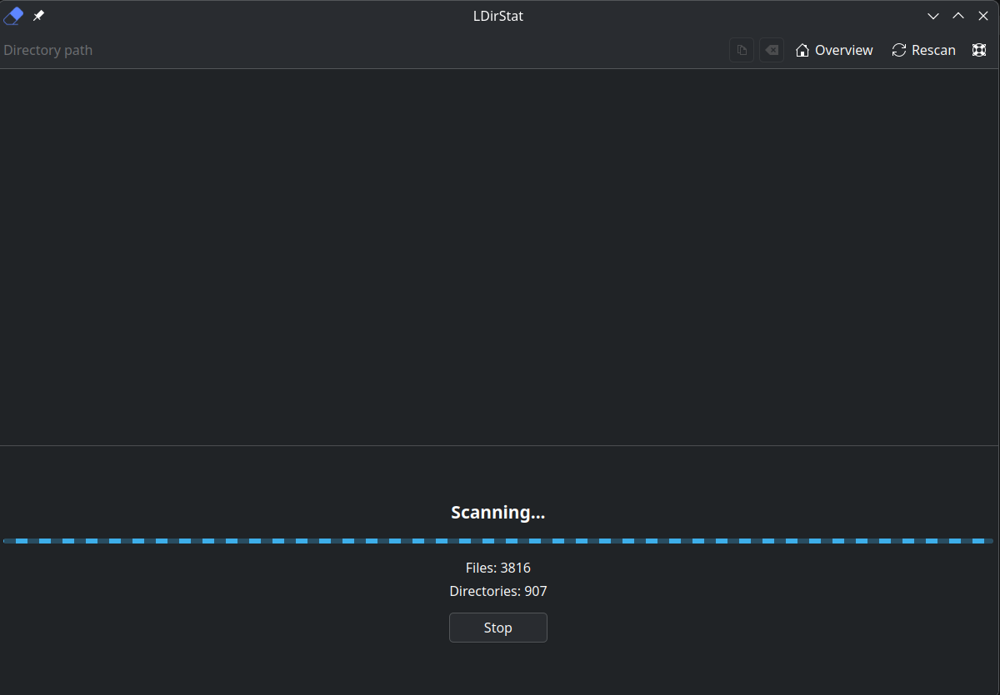

## Main Analysis View

When a scan finishes, the window shows two stacked areas:

- **Directory list** at the top
- **Graph view** at the bottom

The directory list and graph stay in sync, so selecting an item in one updates the other.

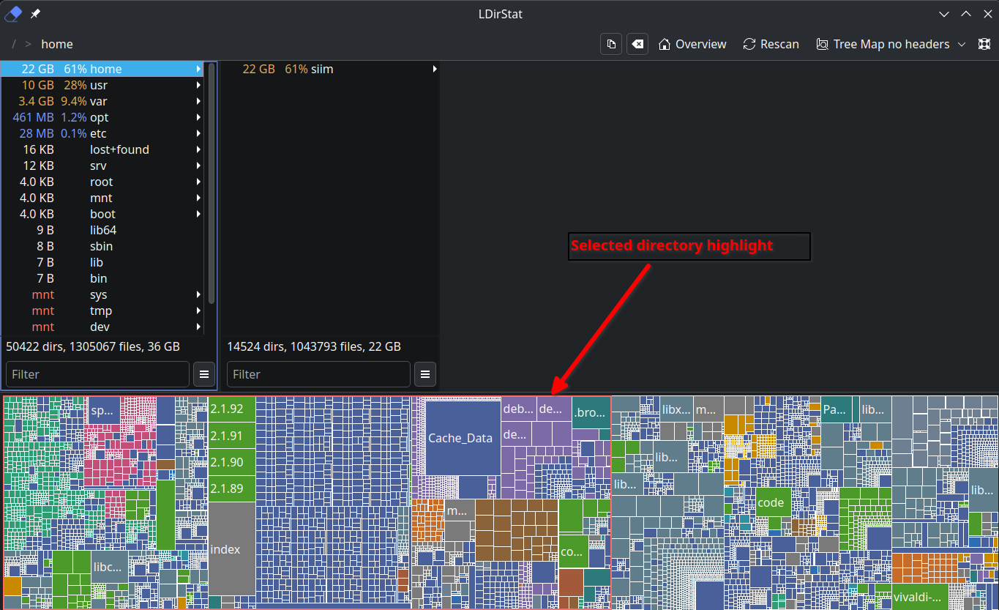

## Top Bar and Breadcrumb

The top bar helps you move around the scan without starting over.

- The breadcrumb path shows the directory you are currently looking at
- Click any breadcrumb part to jump back to that folder
- The copy button copies the current directory path
- The clear button jumps back to the scan root
- **Overview** returns to the welcome screen
- **Back** returns from the welcome screen to your current results
- **Rescan** starts the same scan again from the original starting location
- **Graph Type** switches between the available graph views
- The help button opens Help, Report an Issue, and About

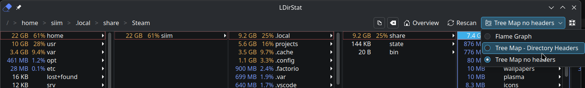

## Directory List

The directory list is a column browser. Each column shows the contents of one folder, sorted by size.

- Click a directory to open its contents in a new column
- Use left, right, up and down arrow keys for fast navigation between directories
- The footer shows totals for the visible items in that column
- Use the **Filter** box at the top of a column to narrow the list
- The small menu next to the filter gives quick selection actions such as **Select All**, **Clear Filter**, and **Invert Selection**
- The same menu also includes **File Category Statistics...** and **Modified Time Histogram...**

Mount points that were skipped during the original scan are marked with **`mnt`** instead of a size.

- Right-click a mount point and choose **Continue Scanning at Mount Point** to scan inside it

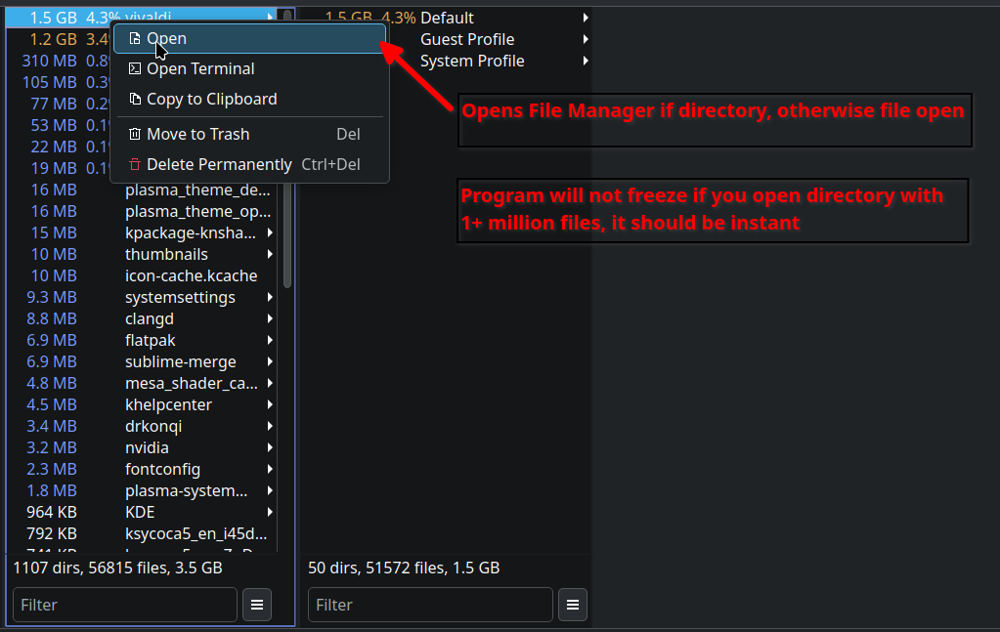
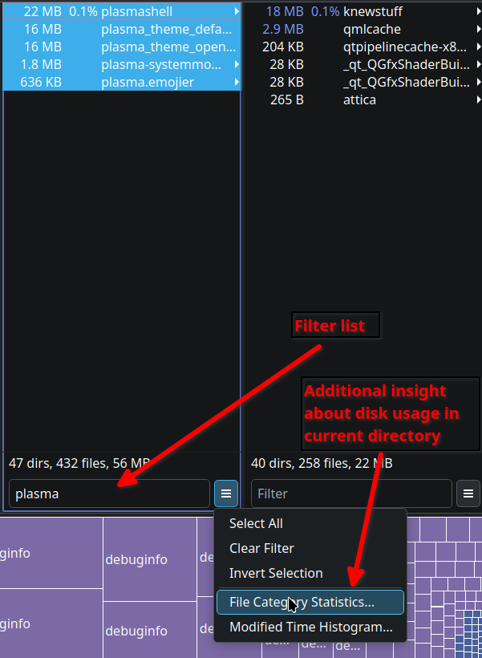
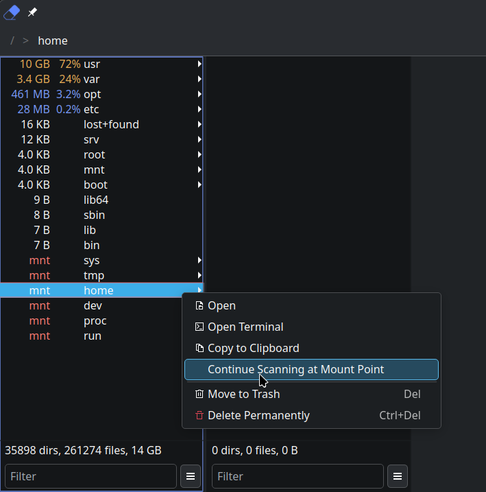

## Statistics Dialogs

The filter menu in each directory column includes two dialogs that analyze the current directory and all subdirectories.

### File Category Statistics

**File Category Statistics...** shows a category breakdown for the current subtree.

- Categories are grouped by file type, such as archives, documents, images, source files, and videos
- Each top-level row shows the file count and total size for that category
- Expand a category to see the individual file types that contribute to it
- The color swatch matches the colors used elsewhere in the app for file categories
- This dialog analyzes the full subtree for that directory, even if a text filter is active

### Modified Time Histogram

**Modified Time Histogram...** shows when files in the current subtree were last changed.

- The histogram is split into 24 time bins across the selected date range
- Use the range slider to narrow the period you want to inspect
- Use the **Metric** selector to switch between **File Count** and **Total File Size**
- Each bar is split into file-category blocks, with larger category contributions shown first
- Hover a bar to see the exact time range and a category breakdown for that bin
- Modified time is used by default, but if a file's creation time is newer than its modified time, the creation time is used instead

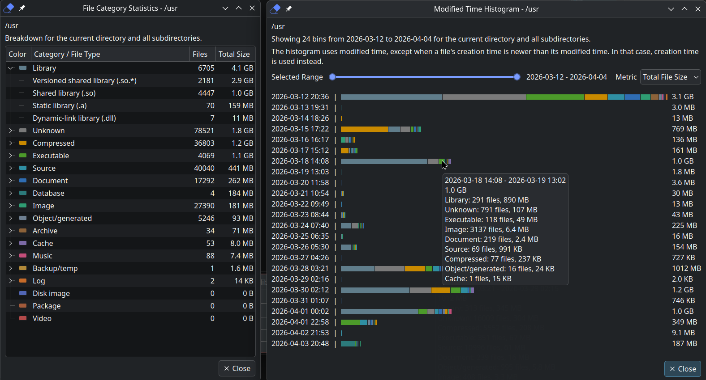

## Graph Views

LDirStat has three graph modes. Use the **Graph Type** button to switch between them.

- **Flame Graph** shows the hierarchy as stacked bars, where wider bars use more space
- **Tree Map - Directory Headers** shows nested rectangles with labeled directory sections
- **Tree Map no headers** shows a denser rectangle view with more detail and fewer labels

You can click items in the graph to select them. Right-clicking a visible graph item opens the same item menu used elsewhere in the app.

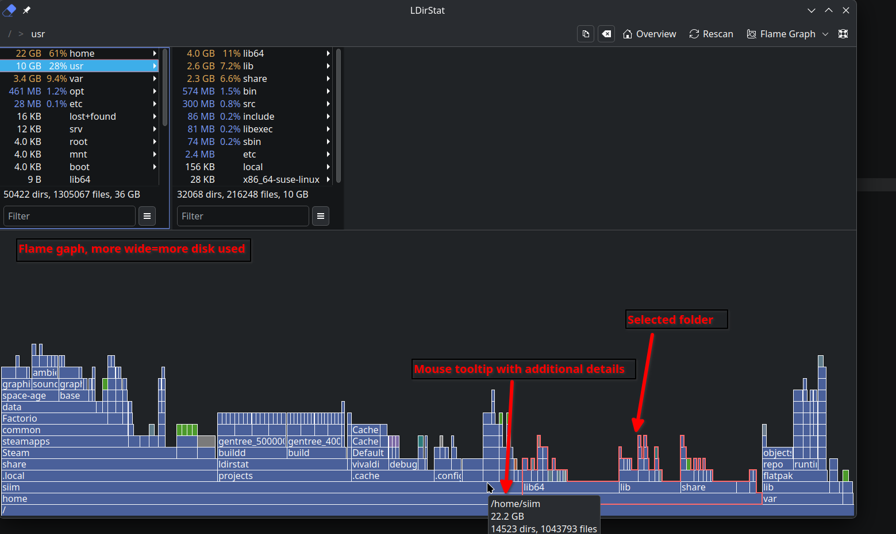
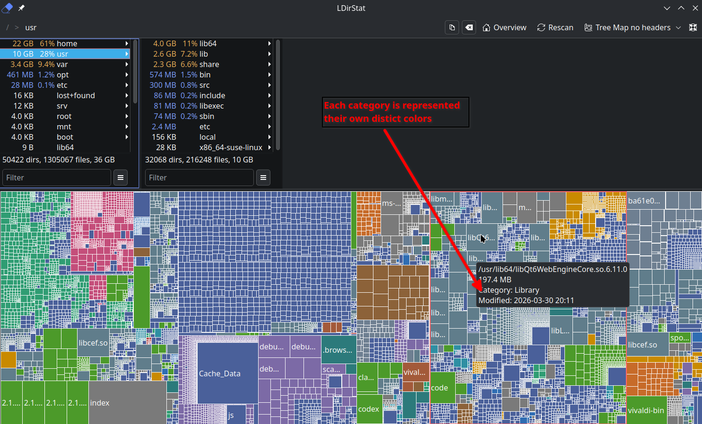
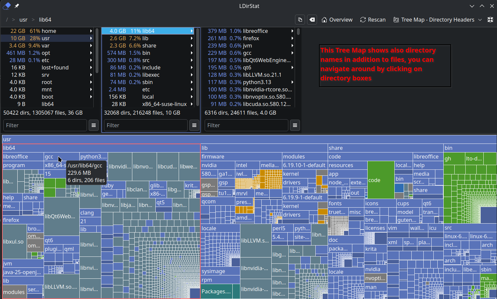

## Right-Click Menu

Right-click an item in the directory list or graph to open the item menu.

Common actions include:

- **Open**
- **Open Terminal**
- **Copy to Clipboard**
- **Move to Trash**
- **Delete Permanently**

For mount points, the menu also includes **Continue Scanning at Mount Point**.

Notes:

- **Copy to Clipboard** copies the selected item path
- The breadcrumb copy button copies the current directory path instead
- **Open Terminal** opens a terminal in the selected directory, or in the parent folder if you selected a file

## Keyboard Shortcuts

| Shortcut | Action |
|---|---|
| Up / Down | Move between items in the current column |
| Left | Move to the parent column |
| Right | Open the selected directory |
| Ctrl+O | Open the selected file or directory |
| Ctrl+T | Open a terminal at the selected location |
| Ctrl+C | Copy the selected item path |
| Delete | Move selected items to trash |
| Ctrl+Delete | Permanently delete selected items |
| Escape | Close any window on the app, including main window |

## Tips

- By default, LDirStat scans only the current filesystem. Other mounted filesystems appear as mount points until you continue scanning into them.
- If a mount point moves after being scanned, LDirStat will select that scanned directory for you automatically.
- Rescan always goes back to the original starting location for that result, not to the last folder you clicked.
- You can return to the welcome screen at any time with **Overview** without losing your current scan.
